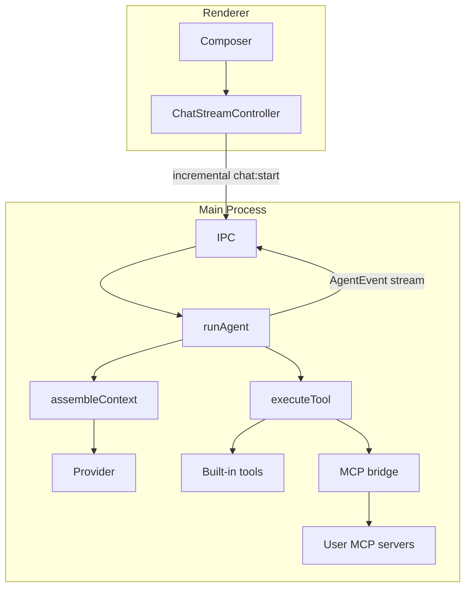

# Vyotiq architecture

## Process boundaries

Vyotiq is an Electron app with four code regions:

| Region | Path | Runs in |
|--------|------|---------|
| **Main** | `src/main/` | Node.js (privileged) |
| **Preload** | `src/preload/` | Sandboxed bridge |
| **Renderer** | `src/renderer/src/` | Chromium (React UI) |
| **Shared** | `src/shared/` | Imported by main, preload, renderer, and tests |

Entry points that must not move:

- `src/main/index.ts`
- `src/preload/index.ts`
- `src/renderer/index.html`
- `src/renderer/src/main.tsx`

## Import rules

| Alias | Scope | Use for |
|-------|-------|---------|
| `@shared/*` | Cross-process | IPC schemas, domain types, utilities used by main and renderer |
| `@renderer/lib/*` | Renderer only | UI components, hooks, renderer utilities |
| `@main/*` | Main only | Window, workspace registry, settings, storage, agent |

**Do not:**

- Import `@main/*` from the renderer or preload
- Import `@renderer/*` from the main process
- Put renderer UI code in `src/shared/`

ESLint `no-restricted-imports` enforces main/renderer boundaries in `eslint.config.mjs`.

## Folder conventions

### Renderer (`src/renderer/src/`)

```
app/           # Shell chrome (sidebar, title bar, workspace tabs)
features/      # Product features
  chat/
    components/
      composer/   # Grid-based chat input module
      MessageList.tsx
      ...
    ChatView.tsx
  settings/
lib/           # Renderer-only shared code (formerly `shared/`)
  ui/          # Visual components only
  markdown/    # Markdown sanitize, highlight, copy helpers
  hooks/
  utils/
```

### Cross-process shared (`src/shared/`)

```
ipc/           # Channels, Zod schemas, IPC helpers
domain/        # Transcript, chat history, providers, effective settings
utils/         # Paths, events, errors, scrub, time format
```

Compatibility barrels at the old root paths (e.g. `src/shared/ipc.ts`) re-export from the new layout.

### Main (`src/main/`)

```
app/           # window.ts, security.ts
workspace/     # Single-workspace pick + multi-tab registry
settings/      # App settings + secrets
storage/       # Paths, atomic write, migrations/
ipc/           # register.ts
agent/         # Agent loop, tools, providers
marketplace/   # Catalog, install, resolve effective MCP/skills/plugins
logging/
```

## Composer variant contract

`Composer` accepts `variant: 'hero' | 'dock'`:

| Variant | When | Gutter |
|---------|------|--------|
| `hero` | Empty chat (welcome state) | None — parent provides `px-5 sm:px-8` |
| `dock` | Active transcript | `CHAT_GUTTER` + sticky bottom blur wrapper |

`ChatView` renders **one** `Composer` and switches variant from transcript emptiness. Attachments and toolbar live inside `ComposerShell` (grid layout, not flex-wrap pill).

### Slash commands

Typing `/` in the composer opens a fuzzy-filtered autocomplete menu (`SlashCommandMenu`). Sources are merged in main (`src/main/agent/slashCommands/`):

| Source | Examples | Resolve behavior |
|--------|----------|------------------|
| Built-ins | `/compact`, `/marketplace`, `/settings`, `/create-rule`, `/help`, `/undo`, `/ask`, `/plan`, `/agent` | Client actions (navigate / compact / create rule file / undo writes / mode switch) or send help text |
| Marketplace skills | `/code-review` | Inject skill body + trailing text, then send (eager system-prompt skills unchanged) |
| Workspace commands | `.vyotiq/commands/*.md`, `.cursor/commands/*.md` | Template send (`{{input}}` supported); Vyotiq wins collisions |
| Workspace rules | existing `.vyotiq/rules` / `.cursor/rules` stems | Open file in the system editor |
| MCP tools | connected `mcp__…` tools | Agent-mediated send hint (no direct JSON arg forms in v1) |

Catalog skills that are not installed or disabled appear muted with Install/Enable CTAs. IPC: `slash-commands:list`, `slash-commands:resolve`, `slash-commands:createRule`, `slash-commands:openFile`.

## Tests

Tests mirror source layout under `tests/`:

- `tests/shared/` — unit tests for `src/shared/*`
- `tests/main/unit/`, `integration/`, `e2e/` — main process
- `tests/renderer/{composer,chat,settings,app}/` — renderer features

Run: `pnpm typecheck && pnpm test`

Coverage for agent context/tools: `pnpm test:coverage`

## Agent loop & context



### Context assembly (`src/main/agent/context/`)

`assembleContext()` builds the wire payload each agent step:

| Layer | Source |
|-------|--------|
| Harness | `resources/harness/default.md` — `loadHarness(workspace)` prefers the workspace copy when present (e.g. after `/harness-apply`), else the bundled app copy (context, tool policy, memory, work style / safety). Applied text is seen on the next invoke / new run, not mid-step. |
| Tool definitions | `AGENT_TOOLS` from `schemas/tools.ts` (short capability descriptions) + MCP |
| Contract | `sessions/{runId}/contract.md` (auto-injected) |
| Workspace snapshot | Manifest detection + capped `git status` |
| Memory index | `.vyotiq/memory/index.md` + `state.md` |
| Compaction summary | `sessions/{runId}/compaction.json` (persisted) |

Compaction triggers at `compactionTriggerRatio` of the model content window (15% buffer reserved). Text tokens are counted with `gpt-tokenizer` (BPE); large blobs fall back to `chars/4`. From step 2 onward, compaction and the context meter prefer provider-reported `inputTokens` when available (`Math.max(estimate, provider)` with a guard against inflated early readings). The composer shows a live context-window meter via `context_usage` events. Structured summaries may auto-promote into `.vyotiq/memory/` when `memoryAutoPromote` is enabled.

Read-only / parallel-safe **built-in** tools (`read`, `search`, `glob`, `grep`, `list_dir`, `web_fetch`, `web_search`, `memory_list`, `memory_read`, `subagent`, `git_status`, `git_diff`, `diagnostics`, `mcp_list_tools`) may execute in parallel (up to 4 concurrent calls; sub-agents up to 2) even when tool approval is on — approval still gates each mutating/network/MCP call individually. Mutating tools (`edit`, `str_replace`, `multi_edit`, `delete`, `terminal`, `todo_write`, `memory_write`, `git_commit`) and all `browser_*` tools run serially (browser tools are never parallel-safe). MCP tools that declare `readOnlyHint: true` may also run in parallel (hint still untrusted for approval exemption). MCP resource/prompt built-ins (`mcp_list_resources`, `mcp_read_resource`, `mcp_list_prompts`, `mcp_get_prompt`) are serial and approval-exempt like `mcp_list_tools`, but not parallel-safe. `web_fetch`, `web_search`, and all `browser_*` tools are still gated in `mutating` approval mode (network egress). **MCP tools are never approval-exempt via `readOnlyHint`** — the hint is not trusted for approval. In `mutating`/`all` modes MCP tools still require approval unless the user allowlists that tool for the session or workspace.

**Interaction modes (Ask / Plan / Agent):** Composer mode picker (also `/ask`, `/plan`, `/agent`). Ask exposes read-only built-ins (including browse/wait/history/`browser_tabs`, not click/type/fill/press_key/select_option) plus **MCP tools that declare `readOnlyHint: true`** (hint is still never trusted for parallel or approval exemption), `mcp_list_tools`, and MCP resource/prompt built-ins (`mcp_list_resources`, `mcp_read_resource`, `mcp_list_prompts`, `mcp_get_prompt`). Plan adds `todo_write`, `diagnostics`, and `edit`/`str_replace`/`multi_edit` only for run artifacts `plan.md` / `contract.md` (not `subagent`), plus the same read-only MCP filter. Agent is full tools (built-ins + all MCP); `edit`/`str_replace`/`read`/`multi_edit` of `contract.md` remap to the run directory, and `plan.md` remaps in Agent when a run `plan.md` already exists (Plan handoff). Mode is passed on `chatStart` and enforced by filtering tool defs plus a hard execute gate (`modePolicy.ts`). A short mode section is injected into the system prompt for Ask/Plan/Agent and kept across compaction rebuilds. After Plan drafts `plan.md`, the composer shows **Continue in Agent** (switches mode and prefills an implement prompt). Bundled `code-review-graph` MCP is auto-installed when missing so graph/semantic tools are available by default (requires `uv`/`uvx` on PATH). Sub-agents may use `web_fetch`, `git_status`, `git_diff`, `diagnostics`, and `memory_read` in addition to the core read tools — except when the parent run is Ask, where `diagnostics` is stripped from the subagent allowlist. Sub-agent system prompts also inject workspace rules via `buildWorkspaceRulesSection` (capped), matching parent-run rules injection. Note: `diagnostics` is parallel-safe for Agent/Plan but is **not** Ask-safe on the parent built-in set.

**Home workspace:** When no project tabs are open, main opens/creates `~/Vyotiq` (`ensureHomeWorkspace`) so the composer always has a real workspace path for send and tools. Closing the last tab reopens home.

Built-in tool descriptions are short capability blurbs in `TOOL_REGISTRY` (`src/main/agent/schemas/tools.ts`), not a harness catalog. Keep each description aligned with the handler, argument schema, limits, and classification; `tests/main/unit/toolsSchema.test.ts` enforces registry parity and the harness boundary. The harness keeps cross-cutting tool policy (MCP naming/approval, attachments, don’t narrate).

### MCP tools (`src/main/agent/mcp/`)

User-configured MCP servers expose namespaced tools: `mcp__{serverId}__{toolName}`. Transports: **stdio**, **HTTP (streamable)**, and **SSE**. Main process connects servers; tools merge with the **41** built-ins at runtime (`read`, `edit`, `str_replace`, `multi_edit`, `delete`, `search`, `glob`, `grep`, `list_dir`, `terminal`, `todo_write`, `web_fetch`, `web_search`, `browser_navigate`, `browser_snapshot`, `browser_scroll`, `browser_click`, `browser_type`, `browser_fill`, `browser_tabs`, `browser_back`, `browser_forward`, `browser_wait_for_selector`, `browser_wait_for_url`, `browser_press_key`, `browser_select_option`, `mcp_list_tools`, `mcp_list_resources`, `mcp_read_resource`, `mcp_list_prompts`, `mcp_get_prompt`, `subagent`, `memory_list`, `memory_read`, `memory_write`, `git_status`, `git_diff`, `git_commit`, `diagnostics`, `ask_question`, `switch_mode`). Server ids must not contain `__`. Use `mcp_list_tools` when MCP defs were trimmed from the model context budget; use `mcp_list_resources` / `mcp_list_prompts` when servers advertise resources or prompts.

**Agent browser:** Docked right-column panel in the chat side rail (Browser / Terminal / Changes / Plan icons; no overlay). Opening a panel pushes the chat column left in layout flow; closed by default; browser auto-opens when a browser tool loads a page. Hosts multi-tab live `WebContentsView`s (isolated session `persist:vyotiq-agent-browser`). Chrome includes address bar, history/recents dropdown (persisted), reload, and a “…” menu (screenshot to run artifacts, hard reload, copy URL, bookmark-bar toggle, clear history/cookies/cache for the agent partition only). Empty state shows Recents or “No page loaded”. `browser_tabs` lists/opens/closes/selects tabs; optional `tab_id` on other browser tools targets a tab (default: active). `browser_navigate` loads public http(s) URLs (same SSRF policy as `web_fetch`, including sync block of private redirects/`will-navigate`, alternate IPv4 encodings, and a post-load `assertPublicUrl` check on every settled navigation); `browser_back` / `browser_forward` walk history with the same SSRF re-check; `browser_wait_for_selector` / `browser_wait_for_url` poll until ready; `browser_snapshot` returns page text, viewport, and `@eN` refs (optional JPEG saved under the run dir); `browser_click` / `browser_type` / `browser_fill` / `browser_press_key` / `browser_select_option` interact (optional `settleMs`). Bounds are reported via `browser:setBounds`.

**Terminal live output:** While `terminal` runs, `terminal_output_delta` events stream capped stdout/stderr into the tool card (not persisted to `events.jsonl`); the final `tool_result` replaces the card body. Background sessions still use `session_id` / `block_until_ms` / `pattern`.

**Write checkpoints:** Before successful `edit` / `multi_edit` / `str_replace` / `delete`, priors are snapshotted under `sessions/{runId}/checkpoints/`. At the end of each invoke, a `writes_checkpoint` event is emitted. The Files Changed card supports per-file **Keep** / **Discard** (and Keep all / Discard all) via `runs:resolveWrites`, expandable inline diffs from tool args, and `/undo` discards all unresolved paths via `runs:resolveWrites` with action `discard` while the run is idle. (`runs:undoWrites` remains available as a main/test API that restores an entire checkpoint in one shot; the UI uses `resolveWrites`.)

**Agent interaction tools:** `ask_question` pauses the run for a structured user answer in the transcript; `switch_mode` lets the agent flip Ask / Plan / Agent mid-run (composer syncs via `mode_changed`). MCP **resources** and **prompts** are available through `mcp_list_resources` / `mcp_read_resource` / `mcp_list_prompts` / `mcp_get_prompt` when a connected server advertises those capabilities.

**Terminal:** Default calls block until exit/`timeoutMs`. Pass `block_until_ms: 0` (or any `block_until_ms`) to run a background session that returns `session_id` + `status`; poll with `{ session_id, block_until_ms, pattern? }`. Still Agent-only, serial, and approval-gated. Shell selection uses Settings `terminalShell` (`auto` / `cmd` / `powershell` / `bash` / `zsh`) via `getSettings().terminalShell`.

**Diagnostics:** The `diagnostics` tool runs a project-aware check; Settings `diagnosticsCommand` overrides the auto-detected command when set.

**Marketplace** (sidebar footer storefront → top-level Marketplace view): sole UI for MCP servers (stdio / HTTP / SSE), skills, and plugins. Home shows Discover / Featured / category sections from a **curated** catalog of installable packages only (official MCP reference servers — filesystem, memory, sequential-thinking via `npx`; fetch, git, time via `uvx` with `mcp<2` pinned for fetch/time SDK compatibility; plus code-review-graph via `uvx` — and Vyotiq skills such as code-review, docs, test-writing, refactor, commit-message, debug, pr-description, security-review, frontend-design, accessibility, api-design, and plugins such as devtools, shipping, quality, electron-app). Empty search results point users to Manage → Add for external MCPs outside the curated list. Cards highlight the package being viewed and show Enabled / Connected / Disabled from install + MCP status (not just “Installed”). Package detail lists nested MCP/skills and links installed packages into Manage. Manage installs, enables, and configures MCP. **Add** supports universal paste (GitHub URL, npm name, `npx`/`uvx` command, remote MCP URL, or Cursor-style `mcpServers` JSON) via detect → preview → add & connect (`src/main/marketplace/mcpImport.ts`), plus import from Cursor/Claude local configs; advanced forms remain for stdio/remote/git/npm/path. Git/npm installs of non-Vyotiq MCP repos synthesize a `vyotiq.mcp.json` when a launch command can be detected. Settings → **Registry** holds only the optional registry URL and remote-install acknowledgement. Packages install into `{userData}/marketplace/`. Marketplace MCP packages use `vyotiq.mcp.json`. Remote MCP supports Bearer tokens in OS secure storage and **Sign in with OAuth** (Authorization Code + PKCE). Per-server `allowedTools` / `deniedTools` filter which tools are exposed and invokable. When enabled, the local MCP client connects and tools load into the agent. Skills use `skill.md` (eager system-prompt injection). Plugins (`vyotiq.plugin.json`) atomically expand nested MCP + skills + rules when enabled.

Effective MCP set for a run = configured (manual) entries + marketplace MCP packages + plugin-nested MCP, after workspace enable overrides (`src/main/marketplace/resolve.ts`).

### Run persistence

Per-workspace runs live under AppData `workspaces/{workspaceId}/sessions/{runId}/`:

- `messages.jsonl` — canonical chat transcript
- `events.jsonl` — streamed agent events (including compaction)
- `compaction.json` — last compaction record
- `contract.md` — goal + done-when (subjective bullets advisory; path/typecheck bullets may be mechanically gated via `contractDoneWhen`)
- `plan.md` — Plan-mode draft (auto-injected as `## Plan` when non-empty / non-stub)
- `receipt.json` — end-of-run structured summary (tool stats, failure clusters, unread edits, verify + contractDoneWhen metadata, optional `subagents[]` index of file-backed reports, contract excerpt)
- `status.json` — run status metadata (includes `mode`, `consecutiveToolFailureSteps`)

Legacy `.vyotiq/runs/` folders are migrated into AppData on startup.

Follow-up turns use incremental IPC (`newMessages` + `runId`); main loads prior messages from disk.

### Verify before done + harness editing scaffold

**Verify before done** (Settings → Agent → `verifyBeforeDone`: `off` | `notice` | `require`) in Agent mode: when the model stops with no tool calls and no **clean** `diagnostics` evidence yet (`ok` with no error-severity lines — `ok: true` plus errors is not evidence), the loop may inject a nudge and continue. `notice` soft-nudges at most once. `require` blocks finish until met: it re-runs an external typecheck on each finish attempt and keeps nudging while dirty (until typecheck is clean, clean diagnostics evidence exists, or the user aborts).

**Contract done-when** (Settings → Agent → `contractDoneWhen`: `off` | `notice` | `require`, default `require`) parses `contract.md` `## Done when` bullets for **checkable** patterns only: backtick/path tokens that must exist on disk, and typecheck/diagnostics language (reuses the external typecheck check). Subjective default-template bullets are skipped — with no checkable criteria the gate is inactive. `notice` soft-nudges once; `require` blocks finish until unmet criteria pass. Runs after the verify-before-done gate; both may combine into one user nudge.

**Harness editing scaffold** (not full Self-Harness / Meta-Harness): each run’s `receipt.json` (and indexed subagent `report.md` files) can be mined with `/harness-review` into `.vyotiq/harness/proposals/*.md` via rule-based weakness extraction with **evidence buckets** (heuristic tags — not AHE). Optional Settings → Agent → `harnessProposalRewriter` (default off) may one-shot rewrite the proposed harness body via the configured model; apply stays human-gated. After a human edits the proposal’s `## Proposed harness body`, `/harness-apply` (confirm dialog) writes only `resources/harness/default.md`, runs a fixed vitest subset (`HARNESS_EVAL_TESTS` in `harnessApply.ts`), refuses apply when gate sources (`harnessApply.ts` + those tests) are dirty in git **or** when `.git` exists but `git status` fails (fail-closed), and reverts that file on failure. Changing evaluator code or the gate test list is a normal PR — not part of `/harness-apply`. Ask mode still denies `diagnostics` on the parent and strips it from subagent tool allowlists.

**Read before edit** (Settings → Agent → `readBeforeEdit`: `off` | `notice` | `require`, default `notice`): in Agent mode, soft-notices after unread edits (`notice`) or **blocks** `edit` / `str_replace` / `multi_edit` on existing unread paths before execution (`require`). Same-step inspect+edit and new-file creates are exempt.

**Sub-agent reports:** Successful (and failed) sub-agent runs persist `subagents/<id>/report.md` (+ `status.json`) under the run directory. The tool result includes the report text and path; `read` remaps `subagents/.../report.md` to the run dir so the parent can re-read after compaction. Parent `receipt.json` may include a minimal `subagents[]` index (`id`, `status`, `reportPath`) scanned at write time. `/harness-review` rule-mines those reports into evidence bullets/buckets (no LLM summarization of report prose).

### Future harness research (proposed)

Net-new behaviors from harness research audits — **documented only; not implemented**:

| Proposal | Why (evidence) | Not doing now |
|---|---|---|
| AHE observational pillars / section auto-merge | Evidence buckets are heuristic tags only | Not AHE; auto-merge is reward-hack risk |
| DGM-style autonomous self-modification | Apply surface is one file + human confirm | Out of product scope |
| Unsupervised Self-Harness (auto-apply rewriter loop) | Rewriter is opt-in + human confirm only | Fixed evaluator + auto-merge not product scope |

## Observability

### Local logs

- **Path:** `%APPDATA%/vyotiq/logs/vyotiq.log` (Windows) — `userData/logs/vyotiq.log` via `electron-log`
- **Rotation:** `maxSize` 5 MB per file (electron-log rotates the active file; archive naming is transport-default)
- **Levels:** `debug` in dev, `info`+ in packaged builds; renderer logs forward to main over IPC
- **API:** `logger.debug|info|warn|error|fatal|exception` in [`src/shared/logger.ts`](../src/shared/logger.ts) with `scope`, `correlationId`, `code`, `err` fields (scrubbed before disk)

### Error taxonomy

Stable codes in [`src/shared/utils/errors.ts`](../src/shared/utils/errors.ts): `IPC_VALIDATION`, `IPC_HANDLER`, `IPC_CLIENT`, `TOOL_EXEC`, `TOOL_APPROVAL`, `AGENT_LOOP`, `AGENT_QUESTION`, `SETTINGS`, `SECRETS`, `RENDERER_CRASH`, `UNCAUGHT`, etc. Use `toLogErr()` for IPC string errors so Sentry is not spammed. IPC wire results remain string-only (`IpcResult.error`); codes are for logs.

### Sentry (opt-in)

Initialized only when **DSN is set at build time** and `settings.telemetryEnabled === true`. Preload does **not** init Sentry — renderer calls `initRendererSentry()` after reading settings. Main adds `release`, `environment`, and `workspaceCount` tags.

### Native crashes

`crashReporter` starts as early as possible in [`src/main/index.ts`](../src/main/index.ts) (before `app.whenReady`, so renderers are monitored). Local minidumps land under `userData/Crashpad` (`uploadToServer: false`). On Windows, hardware acceleration is disabled at startup to avoid a Chromium cascade seen in the field (`Network service crashed` → `RENDERER_CRASH`). Main window logging attaches `render-process-gone` (code `RENDERER_CRASH`, includes `crashDumps` path), `unresponsive`, and `responsive` via `attachWebContentsCrashLogging`. Agent-browser navigations additionally log `did-fail-load`. Renderer installs `window.onerror` and `unhandledrejection` via [`src/renderer/src/logging/handlers.ts`](../src/renderer/src/logging/handlers.ts).

### Debugging checklist

1. Reproduce the issue, then open **Settings → General → Open logs folder** (or `%APPDATA%/vyotiq/logs`)
2. Search for `[error]` / `[fatal]` and the relevant `scope` (`ipc`, `agent`, `tools`, `chat`, `renderer`)
3. Match `correlationId` to `runId` when debugging agent runs
4. Enable **telemetry** in Settings only if you want events sent to Sentry (requires build-time DSN)
