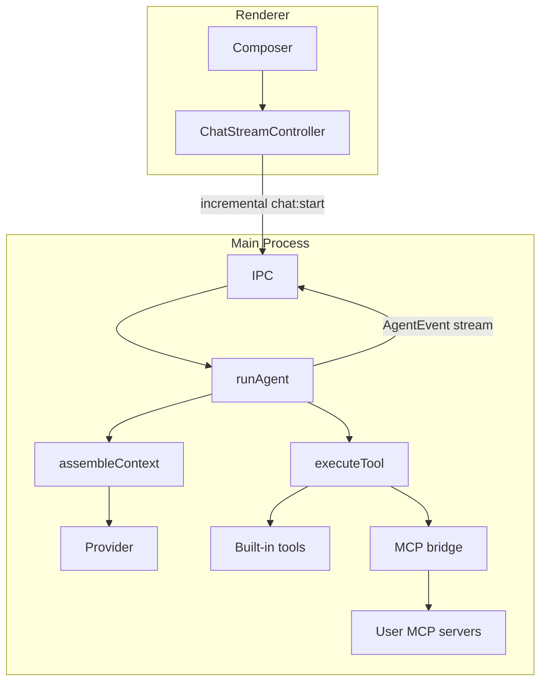

# Vyotiq architecture

## Process boundaries

Vyotiq is an Electron app with four code regions:

| Region | Path | Runs in |
|--------|------|---------|
| **Main** | `src/main/` | Node.js (privileged) |
| **Preload** | `src/preload/` | Sandboxed bridge |
| **Renderer** | `src/renderer/src/` | Chromium (React UI) |
| **Shared** | `src/shared/` | Imported by main, preload, renderer, and tests |

Entry points that must not move:

- `src/main/index.ts`
- `src/preload/index.ts`
- `src/renderer/index.html`
- `src/renderer/src/main.tsx`

## Import rules

| Alias | Scope | Use for |
|-------|-------|---------|
| `@shared/*` | Cross-process | IPC schemas, domain types, utilities used by main and renderer |
| `@renderer/lib/*` | Renderer only | UI components, hooks, renderer utilities |
| `@main/*` | Main only | Window, workspace registry, settings, storage, agent |

**Do not:**

- Import `@main/*` from the renderer or preload
- Import `@renderer/*` from the main process
- Put renderer UI code in `src/shared/`

ESLint `no-restricted-imports` enforces main/renderer boundaries in `eslint.config.mjs`.

## Folder conventions

### Renderer (`src/renderer/src/`)

```
app/           # Shell chrome (sidebar, title bar, workspace tabs)
features/      # Product features
  chat/
    components/
      composer/   # Grid-based chat input module
      MessageList.tsx
      ...
    ChatView.tsx
    RecentsPicker.tsx
  settings/
lib/           # Renderer-only shared code (formerly `shared/`)
  ui/          # Visual components only
  markdown/    # Markdown sanitize, highlight, copy helpers
  hooks/
  utils/
```

### Cross-process shared (`src/shared/`)

```
ipc/           # Channels, Zod schemas, IPC helpers
domain/        # Transcript, chat history, providers, effective settings
utils/         # Paths, events, errors, scrub, time format
```

Compatibility barrels at the old root paths (e.g. `src/shared/ipc.ts`) re-export from the new layout.

### Main (`src/main/`)

```
app/           # window.ts, security.ts
workspace/     # Single-workspace pick + multi-tab registry
settings/      # App settings + secrets
storage/       # Paths, atomic write, migrations/
ipc/           # register.ts
agent/         # Agent loop, tools, providers
logging/
```

## Composer variant contract

`Composer` accepts `variant: 'hero' | 'dock'`:

| Variant | When | Gutter |
|---------|------|--------|
| `hero` | Empty chat (welcome state) | None — parent provides `px-5 sm:px-8` |
| `dock` | Active transcript | `CHAT_GUTTER` + sticky bottom blur wrapper |

`ChatView` renders **one** `Composer` and switches variant from transcript emptiness. Attachments and toolbar live inside `ComposerShell` (grid layout, not flex-wrap pill).

## Tests

Tests mirror source layout under `tests/`:

- `tests/shared/` — unit tests for `src/shared/*`
- `tests/main/unit/`, `integration/`, `e2e/` — main process
- `tests/renderer/{composer,chat,settings,app}/` — renderer features

Run: `pnpm typecheck && pnpm test`

Coverage for agent context/tools: `pnpm test:coverage`

## Agent loop & context



### Context assembly (`src/main/agent/context/`)

`assembleContext()` builds the wire payload each agent step:

| Layer | Source |
|-------|--------|
| Harness | `resources/harness/default.md` (role, contract, tool policy, loop, memory, safety) |
| Tool definitions | `AGENT_TOOLS` from `schemas/tools.ts` (per-tool usage guidance) + MCP |
| Contract | `sessions/{runId}/contract.md` (auto-injected) |
| Workspace snapshot | Manifest detection + capped `git status` |
| Memory index | `.vyotiq/memory/index.md` + `state.md` |
| Compaction summary | `sessions/{runId}/compaction.json` (persisted) |

Compaction triggers at `compactionTriggerRatio` of the model content window (15% buffer reserved). Token usage is estimated heuristically (`chars / 4`) and blended with provider-reported `inputTokens` when within 20% of the estimate. The composer shows a live context-window meter via `context_usage` events. Structured summaries may auto-promote into `.vyotiq/memory/` when `memoryAutoPromote` is enabled.

Read-only / parallel-safe **built-in** tools (`read`, `search`, `glob`, `grep`, `list_dir`, `web_fetch`, `memory_list`, `memory_read`) may execute in parallel (up to 4 concurrent) when tool approval is off. Mutating tools run serially. When a tool-approval gate is active, all tools run serially so prompts do not stack. `web_fetch` is parallel-safe but still gated in `mutating` approval mode (network egress). **MCP tools are never parallel-safe and are never approval-exempt via `readOnlyHint`** — the hint is not trusted. In `mutating`/`all` modes MCP tools still require approval unless the user allowlists that tool for the session or workspace.

Per-tool usage guidance lives in `TOOL_REGISTRY` descriptions (`src/main/agent/schemas/tools.ts` / `toolGuidance.ts`), not in the harness catalog. The harness keeps cross-cutting tool policy (MCP naming/approval, attachments, don’t narrate).

### MCP tools (`src/main/agent/mcp/`)

User-configured stdio MCP servers (Settings → Advanced) expose namespaced tools: `mcp__{serverId}__{toolName}`. Main process spawns servers; tools merge with the **15** built-ins at runtime. Server ids must not contain `__`.

### Run persistence

Per-workspace runs live under AppData `workspaces/{workspaceId}/sessions/{runId}/`:

- `messages.jsonl` — canonical chat transcript
- `events.jsonl` — streamed agent events (including compaction, step budget)
- `compaction.json` — last compaction record
- `contract.md` — goal + done-when
- `status.json` — run status metadata

Legacy `.vyotiq/runs/` folders are migrated into AppData on startup.

Follow-up turns use incremental IPC (`newMessages` + `runId`); main loads prior messages from disk.

## Observability

### Local logs

- **Path:** `%APPDATA%/vyotiq/logs/vyotiq.log` (Windows) — `userData/logs/vyotiq.log` via `electron-log`
- **Rotation:** 5 MB per file, up to 5 archived copies (`vyotiq.log.old.<timestamp>`)
- **Levels:** `debug` in dev, `info`+ in packaged builds; renderer logs forward to main over IPC
- **API:** `logger.debug|info|warn|error|fatal|exception` in [`src/shared/logger.ts`](../src/shared/logger.ts) with `scope`, `correlationId`, `code`, `err` fields (scrubbed before disk)

### Error taxonomy

Stable codes in [`src/shared/utils/errors.ts`](../src/shared/utils/errors.ts): `IPC_VALIDATION`, `IPC_HANDLER`, `IPC_CLIENT`, `TOOL_EXEC`, `AGENT_LOOP`, `RENDERER_CRASH`, `UNCAUGHT`, etc. Use `toLogErr()` for IPC string errors so Sentry is not spammed.

### Sentry (opt-in)

Initialized only when **DSN is set at build time** and `settings.telemetryEnabled === true`. Preload does **not** init Sentry — renderer calls `initRendererSentry()` after reading settings. Main adds `release`, `environment`, and `workspaceCount` tags.

### Native crashes

`crashReporter` starts at main logging init (local minidumps). Main hooks `render-process-gone`, `webContents.crashed`, and `did-fail-load`. Renderer installs `window.onerror` and `unhandledrejection` via [`src/renderer/src/logging/handlers.ts`](../src/renderer/src/logging/handlers.ts).

### Debugging checklist

1. Reproduce the issue, then open **Settings → General → Open logs folder** (or `%APPDATA%/vyotiq/logs`)
2. Search for `[error]` / `[fatal]` and the relevant `scope` (`ipc`, `agent`, `tools`, `chat`, `renderer`)
3. Match `correlationId` to `runId` when debugging agent runs
4. Enable **telemetry** in Settings only if you want events sent to Sentry (requires build-time DSN)
