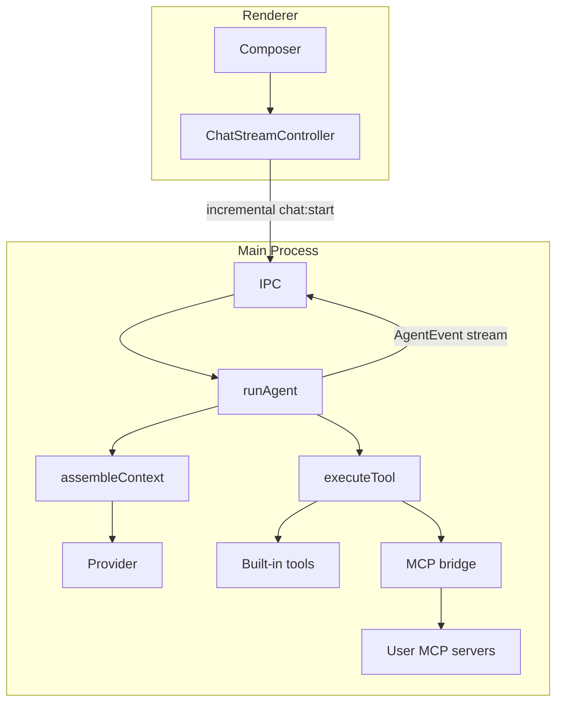

# Vyotiq architecture

## Process boundaries

Vyotiq is an Electron app with four code regions:

| Region | Path | Runs in |
|--------|------|---------|
| **Main** | `src/main/` | Node.js (privileged) |
| **Preload** | `src/preload/` | Sandboxed bridge |
| **Renderer** | `src/renderer/src/` | Chromium (React UI) |
| **Shared** | `src/shared/` | Imported by main, preload, renderer, and tests |

Entry points that must not move:

- `src/main/index.ts`
- `src/preload/index.ts`
- `src/renderer/index.html`
- `src/renderer/src/main.tsx`

## Import rules

| Alias | Scope | Use for |
|-------|-------|---------|
| `@shared/*` | Cross-process | IPC schemas, domain types, utilities used by main and renderer |
| `@renderer/lib/*` | Renderer only | UI components, hooks, renderer utilities |
| `@main/*` | Main only | Window, workspace registry, settings, storage, agent |

**Do not:**

- Import `@main/*` from the renderer or preload
- Import `@renderer/*` from the main process
- Put renderer UI code in `src/shared/`

ESLint `no-restricted-imports` enforces main/renderer boundaries in `eslint.config.mjs`.

## Folder conventions

### Renderer (`src/renderer/src/`)

```
app/           # Shell chrome (sidebar, title bar, workspace tabs)
features/      # Product features
  chat/
    components/
      composer/   # Grid-based chat input module
      MessageList.tsx
      ...
    ChatView.tsx
    RecentsPicker.tsx
  settings/
lib/           # Renderer-only shared code (formerly `shared/`)
  ui/          # Visual components only
  markdown/    # Markdown sanitize, highlight, copy helpers
  hooks/
  utils/
```

### Cross-process shared (`src/shared/`)

```
ipc/           # Channels, Zod schemas, IPC helpers
domain/        # Transcript, chat history, providers, effective settings
utils/         # Paths, events, errors, scrub, time format
```

Compatibility barrels at the old root paths (e.g. `src/shared/ipc.ts`) re-export from the new layout.

### Main (`src/main/`)

```
app/           # window.ts, security.ts
workspace/     # Single-workspace pick + multi-tab registry
settings/      # App settings + secrets
storage/       # Paths, atomic write, migrations/
ipc/           # register.ts
agent/         # Agent loop, tools, providers
marketplace/   # Catalog, install, resolve effective MCP/skills/plugins
logging/
```

## Composer variant contract

`Composer` accepts `variant: 'hero' | 'dock'`:

| Variant | When | Gutter |
|---------|------|--------|
| `hero` | Empty chat (welcome state) | None — parent provides `px-5 sm:px-8` |
| `dock` | Active transcript | `CHAT_GUTTER` + sticky bottom blur wrapper |

`ChatView` renders **one** `Composer` and switches variant from transcript emptiness. Attachments and toolbar live inside `ComposerShell` (grid layout, not flex-wrap pill).

### Slash commands

Typing `/` in the composer opens a fuzzy-filtered autocomplete menu (`SlashCommandMenu`). Sources are merged in main (`src/main/agent/slashCommands/`):

| Source | Examples | Resolve behavior |
|--------|----------|------------------|
| Built-ins | `/compact`, `/marketplace`, `/settings`, `/create-rule`, `/help` | Client actions (navigate / compact / create rule file) or send help text |
| Marketplace skills | `/code-review` | Inject skill body + trailing text, then send (eager system-prompt skills unchanged) |
| Workspace commands | `.vyotiq/commands/*.md`, `.cursor/commands/*.md` | Template send (`{{input}}` supported); Vyotiq wins collisions |
| Workspace rules | existing `.vyotiq/rules` / `.cursor/rules` stems | Open file in the system editor |
| MCP tools | connected `mcp__…` tools | Agent-mediated send hint (no direct JSON arg forms in v1) |

Catalog skills that are not installed or disabled appear muted with Install/Enable CTAs. IPC: `slash-commands:list`, `slash-commands:resolve`, `slash-commands:createRule`, `slash-commands:openFile`.

## Tests

Tests mirror source layout under `tests/`:

- `tests/shared/` — unit tests for `src/shared/*`
- `tests/main/unit/`, `integration/`, `e2e/` — main process
- `tests/renderer/{composer,chat,settings,app}/` — renderer features

Run: `pnpm typecheck && pnpm test`

Coverage for agent context/tools: `pnpm test:coverage`

## Agent loop & context



### Context assembly (`src/main/agent/context/`)

`assembleContext()` builds the wire payload each agent step:

| Layer | Source |
|-------|--------|
| Harness | `resources/harness/default.md` (role, contract, tool policy, loop, memory, safety) |
| Tool definitions | `AGENT_TOOLS` from `schemas/tools.ts` (short capability descriptions) + MCP |
| Contract | `sessions/{runId}/contract.md` (auto-injected) |
| Workspace snapshot | Manifest detection + capped `git status` |
| Memory index | `.vyotiq/memory/index.md` + `state.md` |
| Compaction summary | `sessions/{runId}/compaction.json` (persisted) |

Compaction triggers at `compactionTriggerRatio` of the model content window (15% buffer reserved). Text tokens are counted with `gpt-tokenizer` (BPE); large blobs fall back to `chars/4`. From step 2 onward, compaction and the context meter prefer provider-reported `inputTokens` when available (`Math.max(estimate, provider)` with a guard against inflated early readings). The composer shows a live context-window meter via `context_usage` events. Structured summaries may auto-promote into `.vyotiq/memory/` when `memoryAutoPromote` is enabled.

Read-only / parallel-safe **built-in** tools (`read`, `search`, `glob`, `grep`, `list_dir`, `web_fetch`, `browser_navigate`, `browser_snapshot`, `memory_list`, `memory_read`, `subagent`, `git_status`, `git_diff`, `diagnostics`) may execute in parallel when tool approval is off: ordinary read/network calls allow up to 4 concurrent calls, while sub-agent loops allow up to 2. Mutating tools (`edit`, `str_replace`, `multi_edit`, `delete`, `terminal`, `todo_write`, `memory_write`) run serially. When a tool-approval gate is active, all tools run serially so prompts do not stack. `web_fetch`, `browser_navigate`, and `browser_snapshot` are parallel-safe but still gated in `mutating` approval mode (network egress). **MCP tools are never parallel-safe and are never approval-exempt via `readOnlyHint`** — the hint is not trusted. In `mutating`/`all` modes MCP tools still require approval unless the user allowlists that tool for the session or workspace.

**Interaction modes (Ask / Plan / Agent):** Composer mode picker (also `/ask`, `/plan`, `/agent`). Ask exposes read-only built-ins (+ MCP tools with `readOnlyHint`); Plan adds `todo_write` and `edit`/`str_replace` only for run artifacts `plan.md` / `contract.md`; Agent is full tools. Mode is passed on `chatStart` and enforced by filtering tool defs plus a hard execute gate (`modePolicy.ts`). A short mode section is injected into the system prompt for Ask/Plan. After Plan drafts `plan.md`, the composer shows **Continue in Agent** (switches mode and prefills an implement prompt).

Built-in tool descriptions are short capability blurbs in `TOOL_REGISTRY` (`src/main/agent/schemas/tools.ts`), not a harness catalog. Keep each description aligned with the handler, argument schema, limits, and classification; `tests/main/unit/toolsSchema.test.ts` enforces registry parity and the harness boundary. The harness keeps cross-cutting tool policy (MCP naming/approval, attachments, don’t narrate).

### MCP tools (`src/main/agent/mcp/`)

User-configured MCP servers expose namespaced tools: `mcp__{serverId}__{toolName}`. Transports: **stdio**, **HTTP (streamable)**, and **SSE**. Main process connects servers; tools merge with the **21** built-ins at runtime (`read`, `edit`, `str_replace`, `multi_edit`, `delete`, `search`, `glob`, `grep`, `list_dir`, `terminal`, `todo_write`, `web_fetch`, `browser_navigate`, `browser_snapshot`, `subagent`, `memory_list`, `memory_read`, `memory_write`, `git_status`, `git_diff`, `diagnostics`). Server ids must not contain `__`.

**Agent browser:** Dedicated Electron `BrowserWindow` with an isolated session (`persist:vyotiq-agent-browser`). `browser_navigate` loads public http(s) URLs (same SSRF policy as `web_fetch`); `browser_snapshot` returns page text and stores a JPEG under `sessions/{runId}/browser/snapshot.jpg`. A composer-adjacent panel shows the live URL/title, latest snapshot preview, and Show/Close controls. Click/type automation is not included yet.

**Terminal shell:** Settings → Agent → **Terminal shell** (`auto` | `cmd` | `powershell` | `bash`). Default `auto` prefers PowerShell on Windows when `pwsh`/`powershell` is on PATH, else `cmd`. Unix `auto` keeps `$SHELL` / `/bin/sh`. Common Unix builtins are only blocked when the resolved shell is `cmd`.

**Diagnostics:** `diagnostics` runs typecheck (default) or lint. Optional Settings → Agent → **Diagnostics command** overrides typecheck; otherwise package scripts (`typecheck` / `type-check` / `lint`) or `tsc`/`eslint` are used.

**Write checkpoints:** Before successful `edit` / `multi_edit` / `str_replace` / `delete`, priors are snapshotted under `sessions/{runId}/checkpoints/`. At the end of each invoke, a `writes_checkpoint` event is emitted. The Files Changed card supports per-file **Keep** / **Discard** (and Keep all / Discard all) via `runs:resolveWrites`, expandable inline diffs from tool args, and `/undo` discards all unresolved paths via `runs:undoWrites`, while the run is idle.
**Marketplace** (sidebar footer storefront → top-level Marketplace view): sole UI for MCP servers (stdio / HTTP / SSE), skills, and plugins. Home shows Discover / Featured / category sections from a **curated** catalog of installable packages only (official MCP reference servers — filesystem, memory, sequential-thinking via `npx`; fetch, git, time via `uvx` with `mcp<2` pinned for fetch/time SDK compatibility; plus code-review-graph via `uvx` — and Vyotiq skills such as code-review, docs, test-writing, refactor, commit-message, debug, pr-description, security-review, frontend-design, accessibility, api-design, and plugins such as devtools, shipping, quality, electron-app). Empty search results point users to Manage → Add for external MCPs outside the curated list. Cards highlight the package being viewed and show Enabled / Connected / Disabled from install + MCP status (not just “Installed”). Package detail lists nested MCP/skills and links installed packages into Manage. Manage installs, enables, and configures MCP. **Add** supports universal paste (GitHub URL, npm name, `npx`/`uvx` command, remote MCP URL, or Cursor-style `mcpServers` JSON) via detect → preview → add & connect (`src/main/marketplace/mcpImport.ts`), plus import from Cursor/Claude local configs; advanced forms remain for stdio/remote/git/npm/path. Git/npm installs of non-Vyotiq MCP repos synthesize a `vyotiq.mcp.json` when a launch command can be detected. Settings → **Registry** holds only the optional registry URL and remote-install acknowledgement. Packages install into `{userData}/marketplace/`. Marketplace MCP packages use `vyotiq.mcp.json`. Remote MCP supports Bearer tokens in OS secure storage and **Sign in with OAuth** (Authorization Code + PKCE). Per-server `allowedTools` / `deniedTools` filter which tools are exposed and invokable. When enabled, the local MCP client connects and tools load into the agent. Skills use `skill.md` (eager system-prompt injection). Plugins (`vyotiq.plugin.json`) atomically expand nested MCP + skills + rules when enabled.

Effective MCP set for a run = configured (manual) entries + marketplace MCP packages + plugin-nested MCP, after workspace enable overrides (`src/main/marketplace/resolve.ts`).

### Run persistence

Per-workspace runs live under AppData `workspaces/{workspaceId}/sessions/{runId}/`:

- `messages.jsonl` — canonical chat transcript
- `events.jsonl` — streamed agent events (including compaction)
- `compaction.json` — last compaction record
- `contract.md` — goal + done-when
- `plan.md` — Plan-mode draft (created when mode is Plan; not auto-injected into context)
- `status.json` — run status metadata

Legacy `.vyotiq/runs/` folders are migrated into AppData on startup.

Follow-up turns use incremental IPC (`newMessages` + `runId`); main loads prior messages from disk.

## Observability

### Local logs

- **Path:** `%APPDATA%/vyotiq/logs/vyotiq.log` (Windows) — `userData/logs/vyotiq.log` via `electron-log`
- **Rotation:** 5 MB per file, up to 5 archived copies (`vyotiq.log.old.<timestamp>`)
- **Levels:** `debug` in dev, `info`+ in packaged builds; renderer logs forward to main over IPC
- **API:** `logger.debug|info|warn|error|fatal|exception` in [`src/shared/logger.ts`](../src/shared/logger.ts) with `scope`, `correlationId`, `code`, `err` fields (scrubbed before disk)

### Error taxonomy

Stable codes in [`src/shared/utils/errors.ts`](../src/shared/utils/errors.ts): `IPC_VALIDATION`, `IPC_HANDLER`, `IPC_CLIENT`, `TOOL_EXEC`, `AGENT_LOOP`, `RENDERER_CRASH`, `UNCAUGHT`, etc. Use `toLogErr()` for IPC string errors so Sentry is not spammed.

### Sentry (opt-in)

Initialized only when **DSN is set at build time** and `settings.telemetryEnabled === true`. Preload does **not** init Sentry — renderer calls `initRendererSentry()` after reading settings. Main adds `release`, `environment`, and `workspaceCount` tags.

### Native crashes

`crashReporter` starts at main logging init (local minidumps). Main hooks `render-process-gone`, `webContents.crashed`, and `did-fail-load`. Renderer installs `window.onerror` and `unhandledrejection` via [`src/renderer/src/logging/handlers.ts`](../src/renderer/src/logging/handlers.ts).

### Debugging checklist

1. Reproduce the issue, then open **Settings → General → Open logs folder** (or `%APPDATA%/vyotiq/logs`)
2. Search for `[error]` / `[fatal]` and the relevant `scope` (`ipc`, `agent`, `tools`, `chat`, `renderer`)
3. Match `correlationId` to `runId` when debugging agent runs
4. Enable **telemetry** in Settings only if you want events sent to Sentry (requires build-time DSN)
