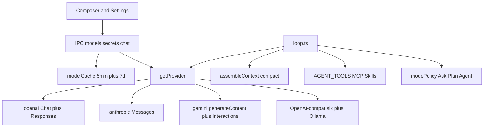

# Current-state audit — VYOTIQ AGENT V

**Research date:** 2026-08-01  
**Scope:** Inventory of LLM providers, protocols, agent product surface, and related gaps as implemented in this repo.  
**Authority:** Code over docs when they disagree (noted below).

---

## 1. Providers (9)

Defined by `ProviderIdSchema` in `src/shared/ipc/schemas/providers.ts`. Registered in `src/main/agent/providers/index.ts`.

| ID | Label | Default base / notes | Auth |
|----|-------|----------------------|------|
| `openai` | OpenAI | `https://api.openai.com/v1` | Bearer secret |
| `anthropic` | Anthropic | `https://api.anthropic.com/v1` (hardcoded) | `x-api-key` |
| `gemini` | Gemini | Generative Language `v1beta` (hardcoded) | `x-goog-api-key` |
| `ollama` | Ollama | Local `http://127.0.0.1:11434`; Cloud `https://ollama.com` | Optional locally; Bearer required for cloud |
| `deepseek` | DeepSeek | `https://api.deepseek.com/v1` | Bearer |
| `groq` | Groq | `https://api.groq.com/openai/v1` | Bearer |
| `openrouter` | OpenRouter | `https://openrouter.ai/api/v1` | Bearer + Referer/Title headers |
| `xai` | xAI | `https://api.x.ai/v1` | Bearer |
| `mistral` | Mistral | `https://api.mistral.ai/v1` | Bearer |

**Secrets:** All nine providers are `SecretProvider`s (`src/shared/ipc/types/secrets.ts`). Keys live in Electron `safeStorage` via `src/main/settings/secrets.ts`.

**Ollama routing:** `resolveEffectiveOllamaHost()` in `src/shared/domain/providers.ts` — if an API key is set and the configured URL is still loopback, the app routes to `https://ollama.com` automatically (chat, catalog, nested/compact/harness runs).

**Not first-class today:** Azure OpenAI, Amazon Bedrock, Google Vertex AI, Cerebras, Fireworks, Together, Cohere, Hugging Face Inference, Cloudflare Workers AI, custom OpenAI-compat “bring your own base URL” (except Ollama’s single base URL field).

---

## 2. Seed models (fallback catalog)

From `SEED_MODEL_IDS` in `src/shared/domain/providers.ts`:

| Provider | Seeds |
|----------|-------|
| openai | `gpt-5.6`, `gpt-5.6-terra`, `gpt-5.6-luna` |
| anthropic | `claude-opus-5`, `claude-sonnet-4`, `claude-haiku-4-5` |
| gemini | `gemini-3.6-flash`, `gemini-2.5-pro` |
| ollama | `qwen2.5`, `llama3.2`, `deepseek-r1`, `gpt-oss:120b`, `deepseek-v4-flash` |
| deepseek | `deepseek-v4-flash`, `deepseek-v4-pro` |
| groq | `llama-4-scout-17b-16e-instruct` |
| openrouter | `openrouter/auto` |
| xai | `grok-4-latest` |
| mistral | `mistral-large-latest` |

Live catalogs come from each provider’s `/models` (or equivalent). Cache: 5 min memory + 7 day disk (`src/main/agent/providers/modelCache.ts`). Empty/error/timeout → seeds + warning string.

Context-window backfill: `src/shared/domain/modelContextWindows.ts` (DeepSeek V4 at 1M; many frontier IDs still absent from the table).

**Default settings:** `provider: 'ollama'`, `model: 'qwen2.5'` (`DEFAULT_SETTINGS` in `src/shared/ipc/schemas/settings.ts`).

---

## 3. API protocols

| Provider | Default chat | Thinking / reasoning path |
|----------|--------------|---------------------------|
| OpenAI | Chat Completions SSE | Responses API when thinking + model matches reasoning family (`openaiResponses.ts`) |
| Anthropic | Messages API SSE | Same Messages API (`budget_tokens` / adaptive) |
| Gemini | `streamGenerateContent` | Interactions API when thinking + Gemini 2.5/3.x (`geminiInteractions.ts`) |
| DeepSeek, Groq, OpenRouter, xAI, Mistral, Ollama | OpenAI-compat Chat Completions | Compat reasoning fields (`think`, `reasoning_effort`, unified `reasoning`, etc.) |

Thinking API enum: `thinkingApiFor()` in `src/shared/domain/reasoning.ts` (`responses` | `interactions` | `messages` | `chat_completions`).

Reasoning state is replayed across tool loops via `ProviderReasoningState` on `ProviderChatRequest`.

---

## 4. Model capability flags

`ModelInfoSchema` (`src/shared/ipc/schemas/providers.ts`):

- `inputModalities` / `outputModalities`
- `supportsTools`, `supportsVision`, `supportsStructuredOutput`, `supportsThinking`
- `thinkingApi`, `supportedServiceTiers`, `contextWindow`, `maxOutputTokens`

Wire caps (`normalize.ts`): Anthropic image+PDF; Gemini image+audio+file; OpenAI image+audio; Ollama/Mistral image-only (Ollama base64). Output modalities are text-oriented in the agent path; image generation is filtered out of catalogs.

Service tiers: `default` / `flex` / `priority` (UI label **Fast** for `priority`, which OpenAI maps to Fast mode) for OpenAI o3/o4/gpt-5-class and some OpenRouter models (`serviceTier.ts`, ModelPicker UI).

---

## 5. Agent product surface

### Built-in tools

Registry: `TOOL_REGISTRY` in `src/main/agent/schemas/tools.ts` (~43 tools including `Skill`, `request_mcp_tools`, browser suite, git, memory, diagnostics, `subagent`, `ask_question`, `switch_mode`).

Execution: `src/main/agent/tools/index.ts` — mode gates, approval, checkpoints, parallel read-safe built-ins (cap 4), serial browser, MCP never parallel-safe for approval exemption via `readOnlyHint`.

### Modes

`ask` | `plan` | `agent` only (`AgentInteractionModeSchema`). **No Debug mode.**

Hard policy: `src/main/agent/tools/modePolicy.ts`.

| Mode | Built-ins | MCP invoke |
|------|-----------|------------|
| Ask | Read-only set (+ browse without click/type/fill) | **Blocked** (meta list/read only) |
| Plan | Ask-safe + `todo_write`, `diagnostics`, edits only to `plan.md`/`contract.md` | **Blocked** |
| Agent | Full | Connected MCP (allow/deny + budget) |

**Docs drift:** `docs/architecture.md` still describes Ask/Plan MCP via `readOnlyHint: true`. **Code is authoritative:** MCP tool *invocation* is Agent-only.

### MCP

`src/main/agent/mcp/` — stdio, HTTP streamable, SSE; OAuth PKCE; resources/prompts; marketplace packages. Slash MCP is agent-mediated (no direct JSON args in v1).

### Skills / marketplace / slash

Marketplace catalog under `resources/marketplace/`. Skills: Level-1 metadata in system prompt; Level-2 via `Skill` tool or slash. Slash sources: builtins, skills, workspace commands, rules, MCP.

### Context

`assembleContext()` + budget shares in `contextBudget.ts` (system 12%, tools 18%, memory/workspace 15%, history 40%, buffer 15%). Compaction at ~70% trigger; manual `/compact`. Anthropic server-side context management beta when provider is Anthropic.

### Nested agents

`runNestedAgent()` — depth 1, exclude `subagent`/`switch_mode`, up to 2 parallel, optional `subagentProvider`/`subagentModel`.

### Checkpoints / harness

Write snapshots before mutating file ops; Keep/Discard; `/undo`. Harness review/apply loop (`harness*.ts`, `docs/harness-handbook.md`).

### Explicitly not implemented

- Embeddings / RAG (README: “No embedding RAG”)
- Image / video generation as agent tools
- TTS / voice output
- Provider-hosted computer use / code interpreter / file search
- Batch API jobs
- Hard agent step-count ceilings (forbidden by project rules)

---

## 6. Key file map

| Area | Paths |
|------|-------|
| Provider registry | `src/main/agent/providers/index.ts`, `openai.ts`, `anthropic.ts`, `gemini.ts`, `openaiResponses.ts`, `geminiInteractions.ts` |
| Domain helpers | `src/shared/domain/providers.ts`, `reasoning.ts`, `modelContextWindows.ts`, `serviceTier.ts` |
| Loop | `src/main/agent/loop.ts`, `nestedAgent.ts`, `compactRun.ts`, `harnessReviewRun.ts` |
| Context | `src/main/agent/context/assemble.ts`, `compact.ts`, `anthropicContext.ts` |
| Modes / tools | `src/main/agent/tools/modePolicy.ts`, `schemas/tools.ts` |
| Settings / UI | `src/shared/ipc/schemas/settings.ts`, `ProvidersSection.tsx`, `ModelPicker.tsx` |
| Product docs | `docs/architecture.md`, `README.md`, `docs/harness-handbook.md` |

---

## 7. Summary diagram

