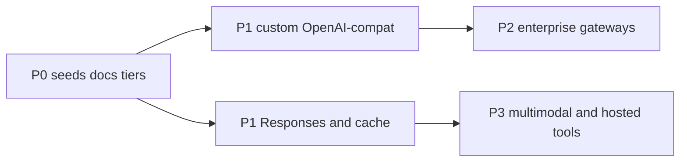

# Prioritized roadmap (research → implementation)

**Research date:** 2026-08-01  
**Status:** P0–P1 done (including deferred composer cache metering, 2026-08-01). P3 Image generation: **implemented** (`generate_image` + `edit_image`; OpenAI/Gemini/xAI/OpenRouter/custom; Ask/Plan dry-run) plus **F0–F5 finish** (HQ params, presets, OpenRouter, custom host probe, code-native/motion harness). Optional `generate_video` remains deferred. Research: [image-capability-finish/](./image-capability-finish/). P2 and remaining P3 remain planning until approved.  
**Inputs:** [03-capability-gap-analysis.md](./03-capability-gap-analysis.md), [04-best-practices-patterns.md](./04-best-practices-patterns.md).

Ask before implementing anything beyond an already-approved plan. Prefer small PRs.

---

## P0 — Cheap, high leverage — DONE

| Item | Status | Primary files |
|------|--------|---------------|
| Refresh `SEED_MODEL_IDS` to mid-2026 GA defaults | Done | `src/shared/domain/providers.ts` |
| Extend `knownContextWindow` for GPT-5.6 / Claude Opus 5 / Grok 4 / Gemini 3 | Done | `src/shared/domain/modelContextWindows.ts` |
| Fix architecture MCP Ask/Plan docs vs `modePolicy` | Done | `docs/architecture.md` |
| Align service-tier UI with OpenAI Fast mode (`priority` API value) | Done | `src/shared/domain/serviceTier.ts` |

**Acceptance:** Seeds match live catalog defaults when keys work; docs match `isMcpAllowedInMode`.

---

## P1 — Product parity (multi-provider) — DONE

| Item | Status | Primary files |
|------|--------|---------------|
| Optional Responses-default for OpenAI GPT-5 / o-series | Done | `openai.ts`, `openaiResponses.ts` |
| Explicit prompt-cache breakpoints for GPT-5.6+ | Done | `openaiResponses.ts`, Chat Completions body |
| **Custom OpenAI-compatible provider** | Done | `ProviderIdSchema` `custom`, `customOpenAiBaseUrl`, settings UI, loop/IPC |
| Richer cache/token metering in composer | Done | Dedicated Prompt cache section + trigger hit %; `cacheCreationInputTokens` pipeline |

**Acceptance:** Custom provider can list models and stream chat against a user-supplied `/v1` host; OpenAI path documents when Completions vs Responses is used.

---

## P2 — Enterprise

| Item | Why | Primary files |
|------|-----|---------------|
| Azure OpenAI provider | Enterprise residency / Entra | New provider module, settings for endpoint + deployment + api-version |
| Amazon Bedrock | Multi-lab under AWS IAM | Provider module; document Responses parity gaps |
| Google Vertex AI | GCP enterprise Gemini | Provider module; auth (ADC / service account) story for Electron |

**Acceptance:** Each enterprise provider can authenticate, list deployable models, and complete a tool-calling agent turn. Feature flags for missing hosted tools.

---

## P3 — Net-new modalities & hosted tools

| Item | Why | Primary files |
|------|-----|---------------|
| Embeddings + optional RAG | Codebase semantic search beyond grep | New embedding client; index store; tools; README currently forbids — product decision first |
| Image generation tool | Design/assets workflows | **Shipped** Slice A–C + F0–F5 (HQ + OpenRouter + custom + code-native/motion harness). Video tool deferred. Research: [image-generation/](./image-generation/README.md), [image-capability-finish/](./image-capability-finish/README.md). |
| Provider computer-use harness | Models trained on hosted schemas | Optional tool path alongside Electron browser tools |
| Provider code-execution sandbox | Safer eval loops | Anthropic/OpenAI hosted tools vs local terminal policy |
| Batch API for offline evals / harness mining | 50% cost for non-interactive jobs | Main-process batch client; not composer chat |

**Acceptance:** Explicit product approval per item; never silently enable RAG or computer-use without Settings.

---

## Explicit non-goals (near term)

- Hard max agent / subagent **step** limits (project rule).
- Replacing client tools entirely with provider-hosted tools.
- Implementing every OpenRouter model as a first-class branded provider.
- Debug interaction mode unless product asks for it.

---

## Suggested implementation order

1. P0 docs + seeds (days).
2. P1 custom OpenAI-compat (largest bang for specialists).
3. P1 Responses/cache depth.
4. P2 only with clear enterprise demand.
5. P3 as separate product bets.
