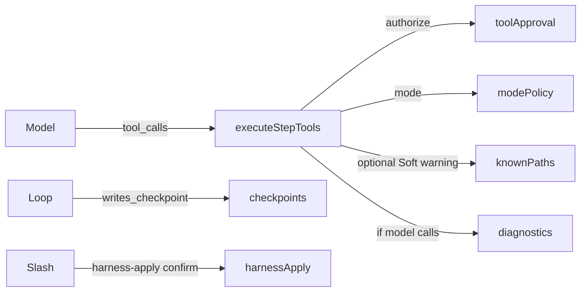

# VYOTIQ mapping (code-verified)

**Audit date:** 2026-08-01  
**Authority:** live source under `src/main/agent/` — not stale `docs/research/01-*` rows.

| ADW practice | Status | Evidence |
|--------------|--------|----------|
| Engineer plan constraint (Plan mode) | **Have** | `modePolicy.ts` Plan allowlist + plan.md/contract.md-only edits; `assertToolAllowedInMode` in `tools/index.ts` |
| Engineer ask/read-only | **Have** | `ASK_SAFE_BUILTIN` in `modePolicy.ts` |
| Engineer review / approval | **Have** | `toolApproval.ts` gates; checkpoints Keep/Discard; harness apply `confirm` |
| Build agent loop | **Have** | `loop.ts` `runAgent` while-true stream→tools |
| Diagnostics as agent tool | **Have** | `tools/diagnostics.ts`, schema ~948+, `tools/index.ts` dispatch |
| Deterministic post-edit validate → re-enter | **Partial** | Soft nudge when step mutates without `diagnostics` (`executeStepTools.ts` + `isFileMutationToolName`); still no auto-run diagnostics |
| Soft read-before-edit warn | **Have** | `executeStepTools.ts` soft warning + unit tests; `knownPaths` invalidated on successful `delete` (`loopPolicy.ts`) |
| Nested abort report soft vs hard | **Have** | `nestedAgent.ts` `nestedAbortReport` uses `runSignal` |
| IPC user-state → `fail` (not `IPC_HANDLER`) | **Have** | resolve/undo/harness + rename + rewind prepare + invalid checkpoint id (`register.ts`) |
| Hard verify-before-done | **Missing** (intentional) | `docs/architecture.md`; harness must not contain phrases (`toolsSchema.test.ts`) |
| Skills ≠ validation runtime | **Have** / skills prose **Partial** | Runtime tools separate; marketplace skills may say “re-run tests” |
| Nested depth ≤ 1 | **Have** | `subagent.ts` `MAX_SUBAGENT_DEPTH = 1` |
| Nested Interrupted vs Cancelled | **Have** | `runSignal` threaded into nested toolCtx (`nestedAgent.ts` / `executeStepTools.ts`) |
| MCP Agent-only invoke | **Have** | `modePolicy.ts` MCP gating |
| Harness human apply + frozen eval | **Have** | `harnessApply.ts` `HARNESS_EVAL_TESTS`, dirty/gate-tamper refuse |
| Editable harness path check | **Have** | `workspaceHasEditableHarness` canonicalize + `resolveInsideWorkspace` |
| Model cache boot compact | **Have** | `compactModelCacheOnBoot` → `ensureDiskLoaded`; `index.ts` boot |
| Full pipeline E2E | **Have** (mocked) | `tests/main/e2e/agentPipeline.test.ts` + unit `agentLoop*` |
| Software factory / ticket router | **Missing** | Out of scope |
| Worktree-per-agent / sandbox product | **Missing** | Workspace + checkpoints only |

## Flow (as implemented)

