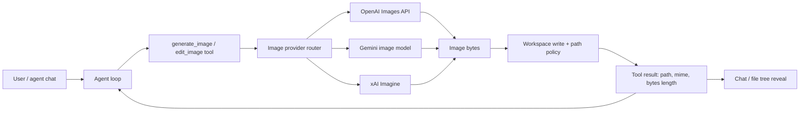

# 05 — Coding-agent integration patterns

**Compiled:** 2026-08-01  
**Sources:** OpenAI / Gemini / xAI official tool & API shapes; coding-agent MCP products (AgentBrush et al.) as **Directional** UX evidence; VYOTIQ architecture (client tools as spine).

---

## 1. What users actually need in a coding agent

From mid-2026 agent-product behavior (Directional, consistent across MCP image servers and OpenAI’s own “save base64 to file” samples):

1. Ask in the **same chat** as the code work (“make an OG image for this landing page”).  
2. Receive a **file in the project** (correct folder, sensible name).  
3. Optionally **iterate** (edit, transparent PNG, reference brand asset).  
4. Stay within **workspace sandbox** (no writing outside the project).

Tab-switching to ChatGPT / a web UI and dragging PNGs back is the failure mode this feature exists to remove.

---

## 2. Recommended architecture for VYOTIQ

Aligns with [04-best-practices-patterns.md](../04-best-practices-patterns.md): **client-executed tools as the product spine**.

**Do not** rely solely on OpenAI Responses hosted `image_generation` — it cannot serve Anthropic/Gemini/Ollama chat sessions.

**Optional later:** when chat provider is OpenAI Responses-capable, allow the hosted tool as an accelerator — still persist bytes to workspace from `image_generation_call.result`.

---

## 3. Tool design practices (real, not decorative)

### Schema (conceptual)

| Field | Purpose |
|-------|---------|
| `prompt` | Required generation instruction |
| `path` | Workspace-relative output path (required or strongly defaulted) |
| `provider` / `model` | Optional override |
| `size` / `aspect_ratio` / `quality` / `resolution` | Provider-normalized options |
| `n` | Cap hard (e.g. 1–4) to control cost |
| `reference_paths` | Existing workspace images for edit/consistency |
| `action` | `generate` \| `edit` when supported |

### Tool result

Return **structured** success:

- `ok: true`
- `path` (workspace-relative)
- `absolutePath` only if policy allows (prefer relative in model-facing text)
- `mimeType`, `byteLength`, `width`/`height` if known
- `provider`, `model`, `revisedPrompt` (if API returns it)
- `moderationPassed`

On failure: actionable message (verification required, moderation blocked, missing key, path escape).

### Mode policy

- **Agent:** allowed (mutating write)  
- **Plan / Ask:** deny or force dry-run description only — product choice; recommend **Agent-only** for v1 to match other write tools  

### Approvals

Treat like other file writes under `toolApproval` (`mutating` / `all`).

### Checkpoints

Generated files should participate in write checkpoints / undo the same way other tool writes do.

---

## 4. Prompting behavior for the **agent** (harness hints)

Keep harness text lean (see system-prompt research). Prefer tool description over long harness essays:

- Prefer concrete paths: `docs/assets/…`, `src/renderer/public/…`
- Prefer `quality=low` / cheap models for drafts; escalate when user asks for final
- For transparency: note OpenAI `gpt-image-2` **cannot** return true transparent backgrounds — two-step (generate on solid → local bg removal) is industry practice (Directional)
- For brand consistency: pass `reference_paths`
- Never invent binary content in chat markdown as a substitute for the tool

---

## 5. Transparency & post-processing

| Approach | Notes |
|----------|-------|
| Native `background: "transparent"` | OpenAI: **not** on `gpt-image-2`; older GPT Image models may differ — check current model |
| Two-step local rembg / similar | Common in agent MCP servers; zero cloud cost for rembg; real alpha PNG |
| Ask user for designer pass | Brand-critical launch assets |

v1 can ship **without** bg-removal if documented; do not fake alpha.

---

## 6. Latency & UX

- Image gens can take **tens of seconds to ~2 minutes** (OpenAI limitation note).  
- Tool UI should show running state; optional partial streaming only if Responses hosted path is used.  
- Cap concurrency (e.g. 1–2 in-flight image jobs) to protect rate limits.

---

## 7. Security

- Path must stay inside workspace (existing FS tool guards).  
- Do not log full base64.  
- When fetching xAI URLs, restrict to expected hosts or prefer b64.  
- Respect moderation failures; do not retry blocked prompts automatically.  
- Reference image reads: same binary/size limits as vision attachments.

---

## 8. Testing strategy (for a future implementation)

| Layer | What |
|-------|------|
| Unit | Size validators; path policy; response parsers (OpenAI/Gemini/xAI fixtures) |
| Tool | Mock fetch → file appears under temp workspace; undo removes it |
| Mode | Ask/Plan cannot write |
| Manual smoke | Real key once per provider before release |

No “returns success without file” tests that greenwash stubs.
