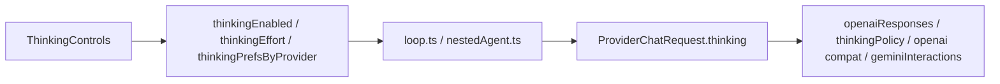

# 05 — VYOTIQ current state (2026-08-02 audit)

## End-to-end path

## Key files

| Layer | Path |
|-------|------|
| Heuristics | `src/shared/domain/reasoning.ts` |
| Settings schema | `src/shared/ipc/schemas/settings.ts` (`ThinkingEffortSchema` duplicate) |
| ModelInfo | `src/shared/ipc/schemas/providers.ts` — only `supportsThinking?`, `thinkingApi?` |
| Normalize / catalog | `src/main/agent/providers/normalize.ts` |
| Anthropic policy | `src/main/agent/providers/thinkingPolicy.ts` |
| OpenAI Responses | `src/main/agent/providers/openaiResponses.ts` |
| OpenAI-compat body | `src/main/agent/providers/openai.ts` `buildOpenAiCompatBody` |
| Gemini | `gemini.ts` + `geminiInteractions.ts` |
| Loop | `src/main/agent/loop.ts`, `nestedAgent.ts` |
| UI | `ThinkingControls.tsx` (heuristic gate; **no ModelInfo prop**) |
| Badge | `ModelPicker.tsx` uses `meta.supportsThinking` (heuristic-filled) |
| Cache | `modelCache.ts` caches `ModelInfo[]` as returned by listModels |

## Defaults

`provider: ollama`, `model: qwen2.5`, `thinkingEnabled: true`, `thinkingEffort: medium`, `showThinking: true`.

## How thinking support is decided today

1. `listModels` → `baseModelInfo` sets `supportsThinking` via `modelSupportsThinking(id)` regex (catalog thinking fields ignored).
2. UI: `ThinkingControls` calls the **same regex** with `provider`+`model` strings — ignores catalog `ModelInfo`.
3. Loop: `thinkingEnabled = settings.thinkingEnabled && (modelInfo.supportsThinking !== false)` — `undefined` still allows thinking.

## Provider wire summary (today)

| Provider | When thinking on |
|----------|------------------|
| OpenAI | Routes to Responses for heuristic/`thinkingApi`; effort normalized; Off omits rather than `none` |
| Anthropic | Adaptive regex (misses 4.6); manual uses fixed 10k budget (ignores effort); Off → `{}` |
| Gemini | Interactions only if enabled + heuristic; generateContent has no thinking config |
| DeepSeek / OpenRouter | Raw effort fields |
| Groq / xAI | Normalized compat effort |
| Ollama | `think: true` only; tags path often omits `providerId` so ollama heuristic misses |

## Tests present

`tests/shared/reasoning.test.ts`, `tests/main/unit/thinkingProviders.test.ts`, `tests/renderer/chat/thinkingControls.test.tsx`, streams/picker coverage.
